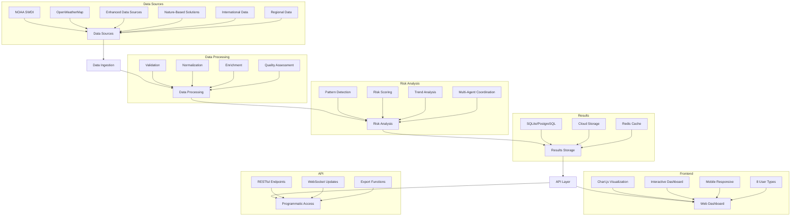

# Pythia - Multi-Agent Extreme Weather Risk Analysis System

---

## 🖥️ Mockup User Journey: Private Equity Investor

> **Step 1: Login & Select User Type**
> - User logs in and selects **Private Equity Investor** from the role selector.
>
> **Step 2: Enter Asset & Location**
> - Prompt: _"Where is your asset of interest?"_
> - User enters: _"Urban southern Brazil, coastal infrastructure, 7-year horizon"_
>
> **Step 3: View Risk Dashboard**
> - Dashboard displays:
>   - **Extreme Weather Risk Score** (e.g., High)
>   - **Top Risks**: Flooding, Heat, Storm Surge
>   - **Confidence Level**: 0.87
>   - **ROI Analysis**: Projected IRR impact, cost/benefit of resilience options
>
> **Step 4: Explore Nature-Based Solutions**
> - System suggests:
>   - Mangrove Restoration (ROI: 15%, Payback: 4 years)
>   - Green Roofs (ROI: 8%, Payback: 6 years)
>
> **Step 5: Export & Share**
> - User exports a PDF/JSON report for stakeholders
> - Option to receive updates or monitor selected strategies

---

## 🎯 What This System Does

- **Risk Assessment**: Analyzes extreme weather risks for specific locations
- **Nature-Based Solutions**: Provides proven adaptation strategies with cost/benefit analysis
- **Financial Analysis**: Calculates ROI for climate resilience investments
- **Data Integration**: Combines weather data, environmental data, and scientific research
- **Multi-Agent Intelligence**: Uses specialized AI agents for different aspects of risk analysis
- **Interactive Dashboard**: Web-based interface for data visualization and analysis
- **API-First Design**: RESTful API for programmatic access and integration
- **A2A Protocol**: Complete Agent-to-Agent communication protocol implementation
- **8 Specialized User Types**: Tailored experience for different professional roles

## 🚀 Quick Start

Want to get started immediately? Follow these steps:

1. **Clone the repository**
2. **Set up your environment** (see Installation section)
3. **Start the web dashboard** (see Usage section)
4. **Explore the features** (see Key Features section)

## Key Features

- **🌿 Nature-Based Solutions**: A database of 500+ climate resilience solutions with cost/benefit analysis
- **💰 Investor-Focused Analysis**: Financial metrics and ROI calculations for property investments
- **🤖 Multi-Agent Architecture**: Specialized agent roles for risk analysis, recommendations, and data management
- **📊 Advanced Analytics**: Historical trend analysis, pattern detection, and risk assessment
- **🔧 ADK Integration**: Google's Agent Development Kit for enhanced performance and reliability
- **📈 Cost/Benefit Analysis**: Detailed financial analysis for climate resilience investments
- **🎯 Scalable Recommendations**: Location-specific solutions for any property type
- **⚡ Function-Based Tools**: Tools are implemented as regular Python functions, automatically wrapped by ADK
- **🌐 Web Dashboard**: Interactive data visualization and analysis interface
- **📱 Mobile Responsive**: Works seamlessly on desktop, tablet, and mobile devices
- **🔗 API-First Design**: RESTful API for programmatic access and integration
- **🔄 A2A Protocol**: Complete Agent-to-Agent communication protocol with message routing
- **📋 Task Management**: Complete task lifecycle management with state tracking and execution
- **📦 Artifact Management**: Full artifact lifecycle with storage, retrieval, and permission checking
- **🔄 Retry Logic**: Enhanced retry logic with exponential backoff and error recovery
- **⚡ Caching System**: Performance optimization with session-level caching and result caching
- **🛡️ Security**: Comprehensive security with authentication, validation, and permission checking
- **📊 Performance Monitoring**: Real-time performance metrics and system health monitoring
- **👥 8 User Types**: Specialized configurations for Private Equity, Loan Officers, Risk Officers, and more
- **🌍 Global Coverage**: International data sources and regional adaptations
- **📊 Data Management**: 20 specialized data management agents for comprehensive data handling

## Technology Stack

### Backend
- **FastAPI**: High-performance Python web framework
- **Google ADK**: Agent Development Kit for multi-agent orchestration
- **A2A Protocol**: Complete Agent-to-Agent communication protocol
- **SQLite/PostgreSQL**: Database for artifacts and session data
- **Redis**: Caching and session management

### Frontend
- **Vanilla JavaScript**: Lightweight, no framework overhead
- **Chart.js**: Interactive data visualization
- **CSS Grid/Flexbox**: Responsive design
- **WebSocket**: Real-time data updates

### Data Sources
- **NOAA SWDI**: Weather and climate data
- **OpenWeatherMap**: Current weather information
- **Nature-Based Solutions Database**: 500+ proven adaptation strategies
- **Enhanced Data Sources**: International and specialized datasets
- **Regional Data**: Prototype-specific data for all geographic regions

## User Types

The system supports 8 specialized user types, each with tailored features and configurations:

### 1. **Private Equity Investor**
- **Focus**: Investment analysis and asset protection
- **Features**: IRR calculations, infrastructure risk assessment, QOZ compliance
- **Example Query**: "What are hurricane risks for manufacturing facilities in Mobile Bay?"

### 2. **Private Debt Investor**
- **Focus**: Debt risk assessment and collateral analysis
- **Features**: Default risk assessment, cash flow analysis, creditworthiness benchmarks
- **Example Query**: "Evaluate private debt investment risks for coastal manufacturing facilities"

### 3. **Loan Officer (Agricultural)**
- **Focus**: Agricultural and commercial lending support
- **Features**: Collateral risk assessment, water management strategies, seasonal planning
- **Example Query**: "What are water scarcity risks for cattle operations in western Kansas?"

### 4. **Data Science Officer**
- **Focus**: Model validation and data integration
- **Features**: Data quality metrics, validation datasets, model performance benchmarks
- **Example Query**: "Validate our agricultural risk models with extreme weather data"

### 5. **Chief Risk Officer**
- **Focus**: Portfolio-level risk management
- **Features**: Portfolio risk assessment, regulatory compliance, capital allocation
- **Example Query**: "Assess portfolio-level extreme weather risks for agricultural lending"

### 6. **Chief Sustainability Officer**
- **Focus**: ESG compliance and green financing
- **Features**: ESG measurement frameworks, biodiversity metrics, green financing benchmarks
- **Example Query**: "Develop ESG compliance strategies for sustainable lending programs"

### 7. **Credit Officer**
- **Focus**: Seasonal credit and working capital analysis
- **Features**: Cash flow analysis, seasonal planning, working capital optimization
- **Example Query**: "Manage seasonal credit lines for dairy operations in Wisconsin"

### 8. **Government Funder**
- **Focus**: Rural development and infrastructure planning
- **Features**: Economic impact assessment, social impact measurement, infrastructure ROI
- **Example Query**: "Plan rural development investments in drought-affected districts"

## A2A Protocol Implementation

The system now includes a **complete A2A (Agent-to-Agent) protocol implementation** with the following components:

### Core A2A Features ✅
- **Message Structure**: Complete A2A message envelope with headers and validation
- **Message Routing**: Agent registration, discovery, and message delivery
- **Task Management**: Full task lifecycle with state tracking and execution
- **Artifact Management**: Complete artifact lifecycle with storage and retrieval
- **Content Handlers**: Support for text, data, file, image, audio, and video content
- **Error Handling**: Comprehensive error recovery with retry logic and circuit breakers
- **Performance Optimization**: Caching, routing optimization, and monitoring

### A2A Usage Examples

```python
# Create and send A2A message
from multi_agent_system.a2a import create_request_message, create_text_part, MessageType

message = create_request_message(
    sender="risk_analyzer",
    recipients=["validation_agent"],
    parts=[create_text_part("Analyze flood risks for NYC")],
    message_type=MessageType.REQUEST
)

# Route message through system
success = await router.route_message(message)
```

```python
# Task management
from multi_agent_system.a2a import TaskManager, TaskState

task = await task_manager.create_task(
    description="Climate risk analysis for NYC",
    timeout_seconds=300,
    priority=1
)

await task_manager.update_task_state(task.task_id, TaskState.RUNNING)
```

```python
# Artifact management
from multi_agent_system.a2a import create_report_artifact

artifact = create_report_artifact(
    name="climate_risk_report",
    content={"risk_level": "high", "confidence": 0.85}
)

artifact_id = artifact_manager.store_artifact(artifact)
```

## Function-Based Tools

Our system uses ADK's elegant function-based tool approach where tools are implemented as regular Python functions that the framework automatically transforms into callable tools:

```python
# Simple function-based tool
def analyze_climate_risk(location: str, time_period: str) -> Dict[str, Any]:
    """
    Analyzes climate risks for a specific location and time period.
    
    Args:
        location (str): The location to analyze
        time_period (str): The time period for analysis
        
    Returns:
        Dict[str, Any]: Analysis results with risk levels and recommendations
    """
    try:
        # Analysis logic here
        return {
            "status": "success",
            "data": {
                "location": location,
                "time_period": time_period,
                "risk_assessment": {
                    "flooding": "medium",
                    "heat_wave": "high",
                    "storm": "low"
                },
                "confidence": 0.85
            }
        }
    except Exception as e:
        return {
            "status": "error",
            "error_message": str(e)
        }

# Create agent with function-based tools
climate_agent = Agent(
    name="climate_analyzer",
    description="Expert in climate risk analysis",
    instruction="Analyze climate risks and provide recommendations",
    tools=[analyze_climate_risk]  # Function is automatically wrapped as a tool
)
```

### Available Tools

- **`analyze_climate_risk(location, time_period, risk_types)`**: Analyzes climate risks for a location
- **`get_weather_data(location, data_sources)`**: Retrieves current weather data
- **`get_nbs_solutions(location, risk_types, solution_scale)`**: Finds nature-based solutions
- **`calculate_cost_benefit(solution_id, property_value, timeframe_years)`**: Performs financial analysis
- **`generate_recommendations(risk_analysis, location, solution_types)`**: Creates comprehensive recommendations
- **`validate_and_geocode(address, validation_level, include_metadata)`**: Validates and geocodes addresses

## Data Flow



## 📦 Installation

### Prerequisites
- Python 3.12 or higher
- Git
- Modern web browser (for dashboard access)
- Google Cloud account (optional - for advanced features)

### Step-by-Step Setup

1. **Clone the repository:**
```bash
git clone https://github.com/leighanne77/MAS_Extreme_Weather.git
cd MAS_Extreme_Weather
```

2. **Create and activate virtual environment:**
```bash
python3.12 -m venv venv
source venv/bin/activate  # On Windows: venv\Scripts\activate
```

3. **Install dependencies:**
```bash
# Using requirements.txt (recommended)
pip install -r requirements.txt

# Or using pyproject.toml
pip install -e .
```

4. **Set up environment variables (optional):**
```bash
# Copy the example environment file
cp .env.example .env

# Edit .env with your settings
# For basic usage, you can leave most settings as defaults
```

5. **Verify installation:**
```bash
python -c "from src.multi_agent_system import agent_team; print('Installation successful!')"
```

### Optional: Google Cloud Setup
For advanced features (data storage, analytics), set up Google Cloud:

1. Create a Google Cloud project
2. Enable required APIs (BigQuery, Firestore, Cloud Storage)
3. Create a service account and download credentials
4. Set environment variable:
```bash
export GOOGLE_APPLICATION_CREDENTIALS="path/to/your/service-account-key.json"
```

## 🚀 Usage

### Web Dashboard (Recommended)

1. **Start the web server:**
```bash
python -m uvicorn src.pythia_web.interface:app --reload --host 0.0.0.0 --port 8000
```

2. **Open your browser:**
Navigate to `http://localhost:8000` to access the interactive dashboard

3. **Use the dashboard:**
- Select your user type from 8 specialized options
- Enter a location (e.g., "Kansas City, MO")
- Ask questions in natural language
- View interactive charts and recommendations
- Export results in various formats

### API Usage

```python
import requests

# Get available user types
response = requests.get("http://localhost:8000/api/user-types")
user_types = response.json()

# Process a user query
response = requests.post("http://localhost:8000/api/query/process", data={
    "query": "What are hurricane risks for manufacturing facilities in Mobile Bay?",
    "session_id": "test_session",
    "user_type": "private_equity"
})

result = response.json()
print(f"Analysis Results: {result}")
```

### Programmatic Usage

```python
from src.multi_agent_system import agent_team
from src.multi_agent_system.session_manager import SessionManager

# Create a session
session_manager = SessionManager()
session = session_manager.create_session("test_user")

# Get the agent team
team = agent_team.get_agent_team()

# Analyze a location
result = team.analyze_location(
    session=session,
    location="Kansas City, MO",
    analysis_type="comprehensive"
)

print(f"Risk Level: {result['risk_level']}")
print(f"Recommendations: {len(result['recommendations'])} found")
```

### Demo Scripts

Run the included demo scripts to see the system in action:

```bash
# Start web dashboard
python -m uvicorn src.pythia_web.interface:app --reload

# Basic demo
python phase5_demo.py

# Test the system
python test_phase5.py
```

### Command Line Interface

```bash
# Run the main application
python src/A2A_app.py

# Run with specific location
python src/A2A_app.py --location "Dallas, TX" --analysis-type "comprehensive"
```

## 🎯 What You Can Do

### For Financial Institutions
- Assess extreme weather risks for loan portfolios
- Evaluate collateral value impacts from environmental factors
- Calculate ROI for climate resilience investments
- Generate risk reports for regulatory compliance
- Access interactive dashboard for portfolio analysis
- Use specialized user types for different roles

### For Property Owners
- Identify location-specific weather risks
- Find proven nature-based solutions
- Calculate cost/benefit of resilience measures
- Get implementation guidance
- Use web dashboard for property analysis

### For Investors
- Analyze environmental risks in investment decisions
- Evaluate climate resilience as investment criteria
- Assess long-term value impacts
- Compare risk profiles across locations
- Access API for integration with existing systems
- Use specialized analysis for different investment types

### Data Sources Available
- **Weather Data**: NOAA SWDI, historical weather patterns
- **Nature-Based Solutions**: 500+ proven adaptation strategies
- **Environmental Data**: Ecosystem services, biodiversity metrics
- **Financial Data**: Cost/benefit analysis, ROI calculations
- **Enhanced Data**: International and specialized datasets
- **Regional Data**: Prototype-specific data for all geographic regions

## ⚠️ Important Limitations

### What This System Does NOT Do
- **No Carbon Trading**: Does not provide carbon credits or carbon market analysis
- **No Proprietary Data Access**: Does not access your internal business data
- **No Real-Time Feeds**: Weather data is cached and updated periodically
- **No Automated Decisions**: Provides insights to support human decision-making
- **No Financial Advice**: Does not provide investment or financial advice

### Data Privacy
- All analysis is performed on external data sources
- No personal or proprietary information is stored
- Results can be exported for integration with your systems
- No access to your internal databases or systems

### Technical Limitations
- Requires internet connection for data updates
- Frontend requires modern web browser with JavaScript enabled
- Dashboard optimized for desktop but mobile-responsive
- Some features require Google Cloud setup
- Performance depends on data source availability
- Not designed for real-time trading or high-frequency analysis

## 🔧 Troubleshooting

### Common Issues

**Import Errors:**
```bash
# Make sure you're in the virtual environment
source venv/bin/activate

# Reinstall dependencies
pip install -r requirements.txt
```

**Web Dashboard Issues:**
```bash
# Check if server is running
curl http://localhost:8000/api/health

# Check browser console for JavaScript errors
# Ensure JavaScript is enabled in your browser
```

**Data Source Errors:**
```bash
# Check internet connection
# Verify API keys if using external services
# Check data source availability
```

**Google Cloud Issues:**
```bash
# Verify credentials are set correctly
echo $GOOGLE_APPLICATION_CREDENTIALS

# Check project permissions
gcloud auth list
```

### Getting Help
- Open an issue on GitHub for bugs

## Contributing

1. Fork the repository
2. Create a feature branch
3. Commit your changes
4. Push to the branch
5. Create a Pull Request

## License

This project is licensed under the MIT License - see the LICENSE file for details.

## Support

For support, please open an issue in the GitHub repository or contact the maintainers. 
