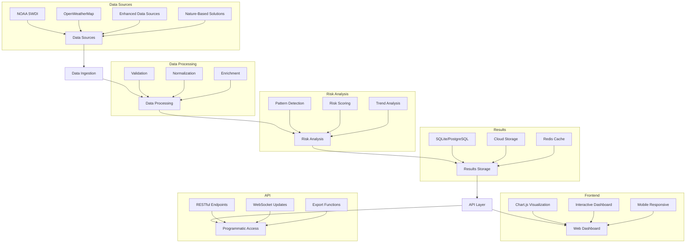

# Multi-Agent System for Extreme Weather Risk Analysis and Nature-Based Solutions

A comprehensive multi-agent system that provides data-driven insights for extreme weather-related risk assessment and nature-based solution recommendations. This system helps financial institutions, property owners, and investors make informed decisions about climate resilience investments through an interactive web dashboard and powerful API.

## 🎯 What This System Does

- **Risk Assessment**: Analyzes extreme weather risks for specific locations
- **Nature-Based Solutions**: Provides proven adaptation strategies with cost/benefit analysis
- **Financial Analysis**: Calculates ROI for climate resilience investments
- **Data Integration**: Combines weather data, environmental data, and scientific research
- **Multi-Agent Intelligence**: Uses specialized AI agents for different aspects of risk analysis
- **Interactive Dashboard**: Web-based interface for data visualization and analysis
- **API-First Design**: RESTful API for programmatic access and integration

## 🚀 Quick Start

Want to get started immediately? Follow these steps:

1. **Clone the repository**
2. **Set up your environment** (see Installation section)
3. **Start the web dashboard** (see Usage section)
4. **Explore the features** (see Key Features section)

## Key Features

- **🌿 Nature-Based Solutions**: A database of climate resilience solutions with cost/benefit analysis
- **💰 Investor-Focused Analysis**: Financial metrics and ROI calculations for property investments
- **🤖 Multi-Agent Architecture**: Specialized agent roles for risk analysis, recommendations, and data management
- **📊 Advanced Analytics**: Historical trend analysis, pattern detection, and risk assessment
- **🔧 ADK Integration**: Google's Agent Development Kit for enhanced performance and reliability
- **📈 Cost/Benefit Analysis**: Detailed financial analysis for climate resilience investments
- **🎯 Scalable Recommendations**: Location-specific solutions for any property type
- **⚡ Function-Based Tools**: Tools are implemented as regular Python functions, automatically wrapped by ADK
- **🌐 Web Dashboard**: Interactive data visualization and analysis interface
- **📱 Mobile Responsive**: Works seamlessly on desktop, tablet, and mobile devices
- **🔗 API-First Design**: RESTful API for programmatic access and integration
- **Workflow Management**: Process orchestration, state tracking, error recovery, and progress monitoring
- **Communication System**: Inter-agent messaging, state synchronization, error propagation, and heartbeat monitoring
- **Artifact Management**: Output storage, version control, cleanup policies, and access control
- **Observability**: Performance metrics, error tracking, pattern analysis, and system health monitoring

## Technology Stack

### Backend
- **FastAPI**: High-performance Python web framework
- **Google ADK**: Agent Development Kit for multi-agent orchestration
- **SQLite/PostgreSQL**: Database for artifacts and session data
- **Redis**: Caching and session management

### Frontend
- **Vanilla JavaScript**: Lightweight, no framework overhead
- **Chart.js**: Interactive data visualization
- **CSS Grid/Flexbox**: Responsive design
- **WebSocket**: Real-time data updates

### Data Sources
- **NOAA SWDI**: Weather and climate data
- **OpenWeatherMap**: Current weather information
- **Nature-Based Solutions Database**: Proven adaptation strategies
- **Enhanced Data Sources**: International and specialized datasets

## Function-Based Tools

Our system uses ADK's elegant function-based tool approach where tools are implemented as regular Python functions that the framework automatically transforms into callable tools:

```python
# Simple function-based tool
def analyze_climate_risk(location: str, time_period: str) -> Dict[str, Any]:
    """
    Analyzes climate risks for a specific location and time period.
    
    Args:
        location (str): The location to analyze
        time_period (str): The time period for analysis
        
    Returns:
        Dict[str, Any]: Analysis results with risk levels and recommendations
    """
    try:
        # Analysis logic here
        return {
            "status": "success",
            "data": {
                "location": location,
                "time_period": time_period,
                "risk_assessment": {
                    "flooding": "medium",
                    "heat_wave": "high",
                    "storm": "low"
                },
                "confidence": 0.85
            }
        }
    except Exception as e:
        return {
            "status": "error",
            "error_message": str(e)
        }

# Create agent with function-based tools
climate_agent = Agent(
    name="climate_analyzer",
    description="Expert in climate risk analysis",
    instruction="Analyze climate risks and provide recommendations",
    tools=[analyze_climate_risk]  # Function is automatically wrapped as a tool
)
```

### Available Tools

- **`analyze_climate_risk(location, time_period, risk_types)`**: Analyzes climate risks for a location
- **`get_weather_data(location, data_sources)`**: Retrieves current weather data
- **`get_nbs_solutions(location, risk_types, solution_scale)`**: Finds nature-based solutions
- **`calculate_cost_benefit(solution_id, property_value, timeframe_years)`**: Performs financial analysis
- **`generate_recommendations(risk_analysis, location, solution_types)`**: Creates comprehensive recommendations
- **`validate_and_geocode(address, validation_level, include_metadata)`**: Validates and geocodes addresses

## Project Structure

### Directory Structure
```
.
├── src/
│   ├── multi_agent_system/
│   │   ├── agents/
│   │   │   ├── __init__.py
│   │   │   ├── base_agent.py
│   │   │   ├── risk_agent.py
│   │   │   ├── historical_agent.py
│   │   │   ├── news_agent.py
│   │   │   ├── recommendation_agent.py
│   │   │   ├── validation_agent.py
│   │   │   ├── greeting_agent.py
│   │   │   ├── farewell_agent.py
│   │   │   ├── cards.py
│   │   │   └── tools.py
│   │   ├── data/
│   │   │   ├── __init__.py
│   │   │   ├── data_source.py
│   │   │   ├── data_sources.py
│   │   │   ├── enhanced_data_sources.py
│   │   │   ├── weather_data.py
│   │   │   ├── nature_based_solutions_source.py
│   │   │   └── nature_based_solutions.json
│   │   ├── a2a/
│   │   │   ├── __init__.py
│   │   │   ├── message.py
│   │   │   ├── multipart.py
│   │   │   ├── parts.py
│   │   │   ├── router.py
│   │   │   ├── task_manager.py
│   │   │   ├── artifacts.py
│   │   │   ├── artifact_manager.py
│   │   │   ├── content_handlers.py
│   │   │   └── enums.py
│   │   ├── workflows/
│   │   │   ├── __init__.py
│   │   │   └── workflows.py
│   │   ├── utils/
│   │   │   ├── __init__.py
│   │   │   └── adk_features.py
│   │   ├── performance/
│   │   │   ├── __init__.py
│   │   │   ├── benchmarking.py
│   │   │   ├── caching.py
│   │   │   ├── load_testing.py
│   │   │   ├── monitoring.py
│   │   │   └── optimization.py
│   │   ├── agent_team.py
│   │   ├── coordinator.py
│   │   ├── communication.py
│   │   ├── session_manager.py
│   │   ├── data_management.py
│   │   ├── artifact_manager.py
│   │   ├── observability.py
│   │   ├── weather_risks.py
│   │   ├── risk_definitions.py
│   │   └── adk_integration.py
│   ├── pythia_web/
│   │   ├── __init__.py
│   │   ├── interface.py
│   │   ├── integration.py
│   │   ├── query/
│   │   │   ├── __init__.py
│   │   │   └── natural_language_processor.py
│   │   ├── session/
│   │   │   ├── __init__.py
│   │   │   └── session_manager.py
│   │   ├── static/
│   │   │   ├── css/
│   │   │   │   └── dashboard.css
│   │   │   └── js/
│   │   │       ├── dashboard.js
│   │   │       ├── simple-charts.js
│   │   │       ├── location-handler.js
│   │   │       ├── confidence-levels.js
│   │   │       ├── resilience-options.js
│   │   │       ├── roi-display.js
│   │   │       ├── simple-filters.js
│   │   │       └── query-suggestions.js
│   │   └── templates/
│   │       ├── dashboard.html
│   │       └── dashboard-simplified.html
│   └── agentic_data_management/
│       ├── agents/
│       │   ├── access_agent.py
│       │   ├── aggregation_agent.py
│       │   ├── audit_agent.py
│       │   ├── base_agent.py
│       │   ├── catalog_agent.py
│       │   ├── compliance_agent.py
│       │   ├── data_agent.py
│       │   ├── enrichment_agent.py
│       │   ├── error_agent.py
│       │   ├── integration_agent.py
│       │   ├── lifecycle_agent.py
│       │   ├── lineage_agent.py
│       │   ├── metadata_agent.py
│       │   ├── notification_agent.py
│       │   ├── performance_agent.py
│       │   ├── quality_agent.py
│       │   ├── security_agent.py
│       │   ├── transformation_agent.py
│       │   ├── validate_agent.py
│       │   ├── validation_agent.py
│       │   └── visualization_agent.py
│       ├── config.py
│       ├── coordinator.py
│       ├── data_manager.py
│       ├── governance.py
│       ├── integrations/
│       │   └── google_cloud.py
│       ├── quality.py
│       ├── schemas.py
│       ├── transformers.py
│       ├── validators.py
│       └── workflows.py
├── tests/
│   ├── conftest.py
│   ├── README.md
│   ├── test_a2a_and_artifacts.py
│   ├── test_agents_and_team.py
│   ├── test_data_and_utils.py
│   ├── test_frontend_simplified.py
│   ├── test_integration_and_observability.py
│   └── test_readme.md
├── docs/
│   ├── PRD.md
│   ├── Do_not_do.md
│   ├── Engineering_Roadmap.md
│   ├── project_structure.md
│   ├── terms_used.md
│   ├── user-guide-mockup.md
│   └── [other documentation files]
├── front_end_documentation_and_todos.md
├── requirements.txt
├── requirements_old.txt
├── pyproject.toml
├── setup.py
├── Makefile
├── README.md
├── TODO.md
└── [other project files]
```

### Core Components

#### 1. Agent System
- **Agent Team** (`agent_team.py`): Comprehensive agent team configuration and management
- **Base Agent** (`agents/base_agent.py`): Core agent implementation with ADK features
- **Specialized Agents**: Risk, Historical, News, Recommendation, Validation, Greeting, Farewell
- **Agent Cards** (`agents/cards.py`): Agent capability definitions

#### 2. Data Management
- **Data Sources** (`data/data_sources.py`): Centralized data source management
- **Enhanced Data Sources** (`data/enhanced_data_sources.py`): International and specialized data
- **Nature-Based Solutions** (`data/nature_based_solutions_source.py`): Nature-based solutions data source
- **Data Manager** (`data_management.py`): Handles data operations with ADK features

#### 3. Web Application
- **FastAPI Interface** (`pythia_web/interface.py`): Main web application entry point
- **Dashboard** (`pythia_web/templates/dashboard.html`): Interactive web interface
- **JavaScript Components**: Chart.js integration, location handling, data visualization
- **API Endpoints**: RESTful API for programmatic access

#### 4. Workflow System
- **Workflows** (`workflows/workflows.py`): Orchestrates risk analysis process
- **Workflow Steps**:
  1. Address Validation
  2. Historical Analysis
  3. Risk Analysis
  4. Nature-Based Solutions Integration
  5. Cost/Benefit Analysis
  6. Report Generation

#### 5. Communication & Coordination
- **Coordinator** (`coordinator.py`): Central coordination and task distribution with parallel execution
- **Communication** (`communication.py`): ✅ Unified communication system with A2A protocol and ADK features

#### 6. Session & Artifact Management
- **Session Manager** (`session_manager.py`): Manages analysis sessions
- **Artifact Manager** (`artifact_manager.py`): Output storage and version control

#### 7. Observability & Monitoring
- **Observability** (`observability.py`): Comprehensive system monitoring
- **Performance Metrics**: System-wide performance tracking
- **Resource Monitoring**: CPU, memory, and network utilization

#### 8. Nature-Based Solutions Integration
- **Nature-Based Solutions Source**: Comprehensive database of climate resilience solutions
- **Solution Categories**: Property-scale, community-scale, and regional solutions
- **Cost/Benefit Analysis**: Financial metrics for investor decision-making

## Data Flow



## 📦 Installation

### Prerequisites
- Python 3.12 or higher
- Git
- Modern web browser (for dashboard access)
- Google Cloud account (optional - for advanced features)

### Step-by-Step Setup

1. **Clone the repository:**
```bash
git clone https://github.com/leighanne77/MAS_Extreme_Weather.git
cd MAS_Extreme_Weather
```

2. **Create and activate virtual environment:**
```bash
python3.12 -m venv venv
source venv/bin/activate  # On Windows: venv\Scripts\activate
```

3. **Install dependencies:**
```bash
# Using requirements.txt (recommended)
pip install -r requirements.txt

# Or using pyproject.toml
pip install -e .
```

4. **Set up environment variables (optional):**
```bash
# Copy the example environment file
cp .env.example .env

# Edit .env with your settings
# For basic usage, you can leave most settings as defaults
```

5. **Verify installation:**
```bash
python -c "from src.multi_agent_system import agent_team; print('Installation successful!')"
```

### Optional: Google Cloud Setup
For advanced features (data storage, analytics), set up Google Cloud:

1. Create a Google Cloud project
2. Enable required APIs (BigQuery, Firestore, Cloud Storage)
3. Create a service account and download credentials
4. Set environment variable:
```bash
export GOOGLE_APPLICATION_CREDENTIALS="path/to/your/service-account-key.json"
```

## 🚀 Usage

### Web Dashboard (Recommended)

1. **Start the web server:**
```bash
python -m uvicorn src.pythia_web.interface:app --reload --host 0.0.0.0 --port 8000
```

2. **Open your browser:**
Navigate to `http://localhost:8000` to access the interactive dashboard

3. **Use the dashboard:**
- Enter a location (e.g., "Kansas City, MO")
- Select analysis parameters
- View interactive charts and recommendations
- Export results in various formats

### API Usage

```python
import requests

# Analyze a location via API
response = requests.post("http://localhost:8000/api/analyze", json={
    "location": "Kansas City, MO",
    "analysis_type": "comprehensive"
})

result = response.json()
print(f"Risk Level: {result['risk_level']}")
print(f"Recommendations: {len(result['recommendations'])} found")
```

### Programmatic Usage

```python
from src.multi_agent_system import agent_team
from src.multi_agent_system.session_manager import SessionManager

# Create a session
session_manager = SessionManager()
session = session_manager.create_session("test_user")

# Get the agent team
team = agent_team.get_agent_team()

# Analyze a location
result = team.analyze_location(
    session=session,
    location="Kansas City, MO",
    analysis_type="comprehensive"
)

print(f"Risk Level: {result['risk_level']}")
print(f"Recommendations: {len(result['recommendations'])} found")
```

### Demo Scripts

Run the included demo scripts to see the system in action:

```bash
# Start web dashboard
python -m uvicorn src.pythia_web.interface:app --reload

# Basic demo
python phase5_demo.py

# Test the system
python test_phase5.py
```

### Command Line Interface

```bash
# Run the main application
python src/A2A_app.py

# Run with specific location
python src/A2A_app.py --location "Dallas, TX" --analysis-type "comprehensive"
```

## 🎯 What You Can Do

### For Financial Institutions
- Assess extreme weather risks for loan portfolios
- Evaluate collateral value impacts from environmental factors
- Calculate ROI for climate resilience investments
- Generate risk reports for regulatory compliance
- Access interactive dashboard for portfolio analysis

### For Property Owners
- Identify location-specific weather risks
- Find proven nature-based solutions
- Calculate cost/benefit of resilience measures
- Get implementation guidance
- Use web dashboard for property analysis

### For Investors
- Analyze environmental risks in investment decisions
- Evaluate climate resilience as investment criteria
- Assess long-term value impacts
- Compare risk profiles across locations
- Access API for integration with existing systems

### Data Sources Available
- **Weather Data**: NOAA SWDI, historical weather patterns
- **Nature-Based Solutions**: 1,000+ proven adaptation strategies
- **Environmental Data**: Ecosystem services, biodiversity metrics
- **Financial Data**: Cost/benefit analysis, ROI calculations
- **Enhanced Data**: International and specialized datasets

## ⚠️ Important Limitations

### What This System Does NOT Do
- **No Carbon Trading**: Does not provide carbon credits or carbon market analysis
- **No Proprietary Data Access**: Does not access your internal business data
- **No Real-Time Feeds**: Weather data is cached and updated periodically
- **No Automated Decisions**: Provides insights to support human decision-making
- **No Financial Advice**: Does not provide investment or financial advice

### Data Privacy
- All analysis is performed on external data sources
- No personal or proprietary information is stored
- Results can be exported for integration with your systems
- No access to your internal databases or systems

### Technical Limitations
- Requires internet connection for data updates
- Frontend requires modern web browser with JavaScript enabled
- Dashboard optimized for desktop but mobile-responsive
- Some features require Google Cloud setup
- Performance depends on data source availability
- Not designed for real-time trading or high-frequency analysis

## 🔧 Troubleshooting

### Common Issues

**Import Errors:**
```bash
# Make sure you're in the virtual environment
source venv/bin/activate

# Reinstall dependencies
pip install -r requirements.txt
```

**Web Dashboard Issues:**
```bash
# Check if server is running
curl http://localhost:8000/health

# Check browser console for JavaScript errors
# Ensure JavaScript is enabled in your browser
```

**Data Source Errors:**
```bash
# Check internet connection
# Verify API keys if using external services
# Check data source availability
```

**Google Cloud Issues:**
```bash
# Verify credentials are set correctly
echo $GOOGLE_APPLICATION_CREDENTIALS

# Check project permissions
gcloud auth list
```

### Getting Help
- Open an issue on GitHub for bugs

## Contributing

1. Fork the repository
2. Create a feature branch
3. Commit your changes
4. Push to the branch
5. Create a Pull Request

## License

This project is licensed under the MIT License - see the LICENSE file for details.

## Support

For support, please open an issue in the GitHub repository or contact the maintainers. 
