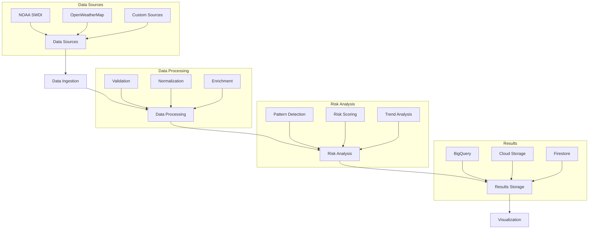

# Climate Risk Analysis System

A sophisticated system for analyzing climate risks using AI agents and advanced data processing capabilities.

## Key Features

- **🌿 Nature-Based Solutions**: Comprehensive database of climate resilience solutions with cost/benefit analysis
- **💰 Investor-Focused Analysis**: Financial metrics and ROI calculations for property investments
- **🤖 Multi-Agent Architecture**: Specialized agent roles for risk analysis, recommendations, and data management
- **📊 Advanced Analytics**: Historical trend analysis, pattern detection, and risk assessment
- **🔧 ADK Integration**: Google's Agent Development Kit for enhanced performance and reliability
- **📈 Cost/Benefit Analysis**: Detailed financial analysis for climate resilience investments
- **🎯 Scalable Recommendations**: Location-specific solutions for any property type
- **⚡ Function-Based Tools**: Tools are implemented as regular Python functions, automatically wrapped by ADK
- **Workflow Management**: Process orchestration, state tracking, error recovery, and progress monitoring.
- **Communication System**: Inter-agent messaging, state synchronization, error propagation, and heartbeat monitoring.
- **Artifact Management**: Output storage, version control, cleanup policies, and access control.
- **Observability**: Performance metrics, error tracking, pattern analysis, and system health monitoring.

## Function-Based Tools

Our system uses ADK's elegant function-based tool approach where tools are implemented as regular Python functions that the framework automatically transforms into callable tools:

```python
# Simple function-based tool
def analyze_climate_risk(location: str, time_period: str) -> Dict[str, Any]:
    """
    Analyzes climate risks for a specific location and time period.
    
    Args:
        location (str): The location to analyze
        time_period (str): The time period for analysis
        
    Returns:
        Dict[str, Any]: Analysis results with risk levels and recommendations
    """
    try:
        # Analysis logic here
        return {
            "status": "success",
            "data": {
                "location": location,
                "time_period": time_period,
                "risk_assessment": {
                    "flooding": "medium",
                    "heat_wave": "high",
                    "storm": "low"
                },
                "confidence": 0.85
            }
        }
    except Exception as e:
        return {
            "status": "error",
            "error_message": str(e)
        }

# Create agent with function-based tools
climate_agent = Agent(
    name="climate_analyzer",
    description="Expert in climate risk analysis",
    instruction="Analyze climate risks and provide recommendations",
    tools=[analyze_climate_risk]  # Function is automatically wrapped as a tool
)
```

### Available Tools

- **`analyze_climate_risk(location, time_period, risk_types)`**: Analyzes climate risks for a location
- **`get_weather_data(location, data_sources)`**: Retrieves current weather data
- **`get_nbs_solutions(location, risk_types, solution_scale)`**: Finds nature-based solutions
- **`calculate_cost_benefit(solution_id, property_value, timeframe_years)`**: Performs financial analysis
- **`generate_recommendations(risk_analysis, location, solution_types)`**: Creates comprehensive recommendations
- **`validate_and_geocode(address, validation_level, include_metadata)`**: Validates and geocodes addresses

## Project Structure

### Directory Structure
```
.
├── src/
│   └── multi_agent_system/
│       ├── agents/
│       │   ├── __init__.py
│       │   ├── base_agent.py
│       │   ├── risk_agent.py
│       │   ├── historical_agent.py
│       │   ├── news_agent.py
│       │   ├── recommendation_agent.py
│       │   ├── validation_agent.py
│       │   ├── greeting_agent.py
│       │   ├── farewell_agent.py
│       │   ├── cards.py
│       │   └── tools.py
│       ├── data/
│       │   ├── __init__.py
│       │   ├── data_source.py
│       │   ├── data_sources.py
│       │   ├── nature_based_solutions_source.py
│       │   └── nature_based_solutions.json
│       ├── workflows/
│       │   ├── __init__.py
│       │   └── workflows.py
│       ├── utils/
│       │   ├── __init__.py
│       │   └── adk_features.py
│       ├── agent_team.py
│       ├── coordinator.py
│       ├── communication.py
│       ├── session_manager.py
│       ├── data_management.py
│       ├── artifact_manager.py
│       ├── observability.py
│       ├── weather_risks.py
│       ├── risk_definitions.py
│       └── adk_integration.py
│   └── agentic_data_management/
│       ├── agents/
│       │   ├── access_agent.py
│       │   ├── aggregation_agent.py
│       │   ├── audit_agent.py
│       │   ├── base_agent.py
│       │   ├── catalog_agent.py
│       │   ├── compliance_agent.py
│       │   ├── data_agent.py
│       │   ├── enrichment_agent.py
│       │   ├── error_agent.py
│       │   ├── integration_agent.py
│       │   ├── lifecycle_agent.py
│       │   ├── lineage_agent.py
│       │   ├── metadata_agent.py
│       │   ├── notification_agent.py
│       │   ├── performance_agent.py
│       │   ├── quality_agent.py
│       │   ├── security_agent.py
│       │   ├── transformation_agent.py
│       │   ├── validate_agent.py
│       │   ├── validation_agent.py
│       │   └── visualization_agent.py
│       ├── config.py
│       ├── coordinator.py
│       ├── data_manager.py
│       ├── governance.py
│       ├── integrations/
│       │   └── google_cloud.py
│       ├── quality.py
│       ├── schemas.py
│       ├── transformers.py
│       ├── validators.py
│       └── workflows.py
└── tests/
    ├── conftest.py
    └── test_agent_system.py
```

### Core Components

#### 1. Agent System
- **Agent Team** (`agent_team.py`): Comprehensive agent team configuration and management
- **Base Agent** (`agents/base_agent.py`): Core agent implementation with ADK features
- **Specialized Agents**: Risk, Historical, News, Recommendation, Validation, Greeting, Farewell
- **Agent Cards** (`agents/cards.py`): Agent capability definitions

#### 2. Data Management
- **Data Sources** (`data/data_sources.py`): Centralized data source management
- **Nature-Based Solutions** (`data/nature_based_solutions_source.py`): Nature-based solutions data source
- **Data Manager** (`data_management.py`): Handles data operations with ADK features

#### 3. Workflow System
- **Workflows** (`workflows/workflows.py`): Orchestrates risk analysis process
- **Workflow Steps**:
  1. Address Validation
  2. Historical Analysis
  3. Risk Analysis
  4. Nature-Based Solutions Integration
  5. Cost/Benefit Analysis
  6. Report Generation

#### 4. Communication & Coordination
- **Coordinator** (`coordinator.py`): Central coordination and task distribution with parallel execution
- **Communication** (`communication.py`): ✅ Unified communication system with A2A protocol and ADK features

#### 5. Session & Artifact Management
- **Session Manager** (`session_manager.py`): Manages analysis sessions
- **Artifact Manager** (`artifact_manager.py`): Output storage and version control

#### 6. Observability & Monitoring
- **Observability** (`observability.py`): Comprehensive system monitoring
- **Performance Metrics**: System-wide performance tracking
- **Resource Monitoring**: CPU, memory, and network utilization

#### 7. Nature-Based Solutions Integration
- **Nature-Based Solutions Source**: Comprehensive database of climate resilience solutions
- **Solution Categories**: Property-scale, community-scale, and regional solutions
- **Cost/Benefit Analysis**: Financial metrics for investor decision-making

## Data Flow



## Installation

1. Clone the repository:
```bash
git clone https://github.com/yourusername/agentic-data-management.git
cd agentic-data-management
```

2. Create and activate a virtual environment:
```bash
python -m venv venv
source venv/bin/activate  # On Windows: venv\Scripts\activate
```

3. Install dependencies:
```bash
pip install -r requirements.txt
```

4. Set up Google Cloud credentials:
   - Create a service account in Google Cloud Console
   - Download the JSON key file
   - Set the environment variable:
```bash
export GOOGLE_APPLICATION_CREDENTIALS="path/to/your/service-account-key.json"
```

5. Create a `.env` file with your configuration:
```env
GOOGLE_CLOUD_PROJECT=your-project-id
GOOGLE_CLOUD_LOCATION=us-central1
GOOGLE_CLOUD_DATASET=agentic_data
GOOGLE_CLOUD_BUCKET=agentic-data
GOOGLE_CLOUD_TOPIC=agentic-events
```

## Architecture Decision

### Hybrid Approach: Custom Core + ADK Coordination

We have chosen a hybrid architecture that combines our custom implementation with Google's Agent Development Kit (ADK) for the following reasons:

1. **Core Components (Custom)**
   - Climate-specific risk analysis logic
   - Weather data caching and processing
   - Specialized agent tools for climate analysis
   - Custom session management for climate data

2. **Agent Coordination (ADK)**
   - Multi-agent system orchestration
   - Event handling and communication
   - Workflow management
   - Session state management

## Contributing

1. Fork the repository
2. Create a feature branch
3. Commit your changes
4. Push to the branch
5. Create a Pull Request

## License

This project is licensed under the MIT License - see the LICENSE file for details.

## Support

For support, please open an issue in the GitHub repository or contact the maintainers. 