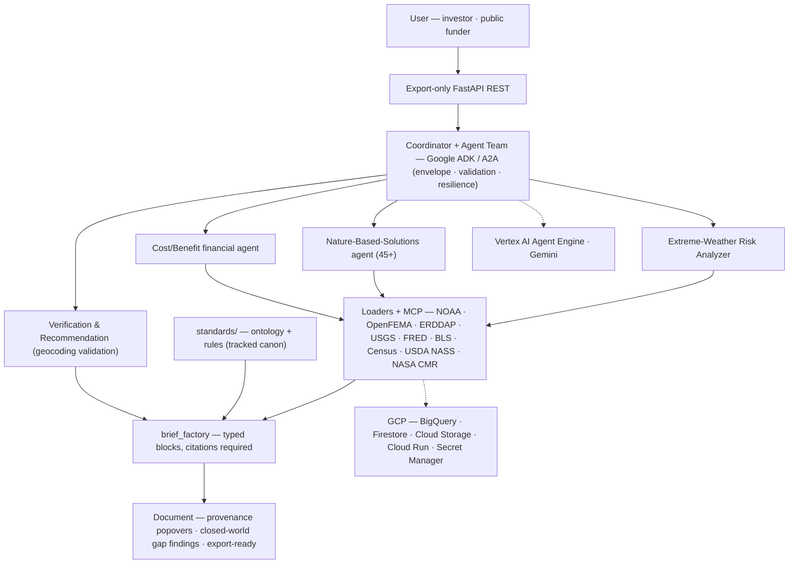
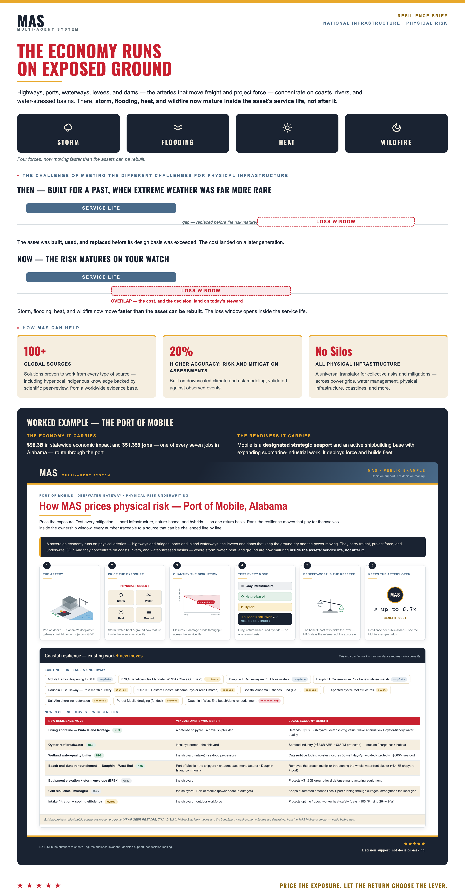

# MAS - Multi-Agent Extreme Weather Risk Analysis System

**Version**: 1.0.0  
**Last Updated**: July 14, 2026


---

## 🛠 Stack

> **By design, not an automated decision-maker**: the system never plugs into financial cores — it delivers verifiable, exportable data for humans to integrate into their own proprietary models.

| Layer | Technology |
|---|---|
| **Agent orchestration** | **Google ADK** — native Python functions auto-wrapped into modular tools · **Google A2A protocol** with a custom message-envelope + validation layer (validated headers; data/text/media content handlers) and a resilience layer (session caching, circuit breakers, exponential-backoff retries) · Vertex AI Agent Engine + Gemini |
| **Worker agents** | Extreme-Weather Risk Analyzer · Nature-Based-Solutions agent (45+ adaptation strategies) · Cost/Benefit financial agent (ROI on resilience, statistically significant improvements only) · Verification & Recommendation agent with geocoding validation |
| **Data layer** | 20+ specialized loaders fusing environmental ground truth (NOAA, OpenFEMA, ERDDAP, USGS, EPA) with an economic ledger (FRED, BLS, Census, USDA NASS) + 45+ curated nature-based-solutions datasets · **MCP** integrations (NASA CMR, ERDDAP, Data.gov) · shared enums, caching, provenance metadata on every loader |
| **Trust core** | `brief_factory` — pydantic v2 frozen block models (**every figure requires a citation by construction**; computed figures carry calculation traces; model-projected figures carry model refs + sensitivity), deterministic compile → lint → render, Jinja2 `StrictUndefined` |
| **Semantic layer** | rdflib · SKOS/OWL boundary ontology (BFO-hooked) · OWL-Time · tracked `standards/` canon with CI composition benchmarks — graph-grounded verification of outputs |
| **Cloud (GCP)** | Cloud Run · Cloud SQL · BigQuery · Firestore · Cloud Storage · Secret Manager · Vertex AI |
| **Vector stores** | **pgvector** (PostgreSQL-native) for now — right-sized to the current corpus after evaluating Pinecone, Weaviate, and ChromaDB; graduates to **Vertex AI Vector Search** as the corpus and retrieval load grow |
| **Web** | Export-only FastAPI REST endpoints · uvicorn |
| **Testing** | pytest — negative tests on block rules (a naked figure is unconstructible), renderer checks, offline fixtures recorded from public APIs |

## 🗺 System at a Glance


```mermaid
flowchart TB
  U["User — investor · public funder"] --> W["Export-only FastAPI REST"]
  W --> C["Coordinator + Agent Team — Google ADK / A2A (envelope · validation · resilience)"]
  C --> A1["Extreme-Weather Risk Analyzer"]
  C --> A2["Nature-Based-Solutions agent (45+)"]
  C --> A3["Cost/Benefit financial agent"]
  C --> A4["Verification & Recommendation (geocoding validation)"]
  A1 --> L["Loaders + MCP — NOAA · OpenFEMA · ERDDAP · USGS · FRED · BLS · Census · USDA NASS · NASA CMR"]
  A2 --> L
  A3 --> L
  L --> BF["brief_factory — typed blocks, citations required"]
  S["standards/ — ontology + rules (tracked canon)"] --> BF
  A4 --> BF
  BF --> DOC["Document — provenance popovers · closed-world gap findings · export-ready"]
  C -.-> V["Vertex AI Agent Engine · Gemini"]
  L -.-> G["GCP — BigQuery · Firestore · Cloud Storage · Cloud Run · Secret Manager"]
```

---

## 🧭 Context Engineering

The big change since the last update: how the system engineers and enforces context management.

- **Tracked `standards/` canon** — the working ontology graphs (risk model, site/asset model, and a worked instance) plus the system rules now live in-repo, never gitignored, with **CI composition benchmarks** (263 / 325 triples) so any ontology change is a deliberate, tested decision.
- **Provenance-first block models** (`src/brief_factory/models/`) — every figure is a frozen, typed object that **cannot exist without at least one citation** (URL or an explicit absence reason, access date, provenance class). Computed figures must carry a calculation trace (formula + named inputs); model-projected figures must carry a model reference (model, version, scenario, validation anchor, confidence grade) and can carry sensitivity entries showing the figure under alternate models.
- **Closed-world statuses** — `verified / estimate / to-be-filled / reported-negative`: a data gap renders as a *finding with a reason*, never a blank or a zero. (See the tide-gauge fixtures: stations whose records ended render as NO-DATA findings with the record dates shown.)
- **New shared enums** (`src/enums.py`): `FigureStatus`, `Grade`, `PreferenceClass`, `EvidenceType`, `SourceContinuity` — one vocabulary across loaders, blocks, and documents.
- **Deterministic document pipeline** (`src/brief_factory/`) — adapter → typed blocks → validation → branded HTML with per-figure citation popovers. No LLM anywhere in the numbers path: agents may draft narrative text, but numbers flow only through typed, cited, tested blocks.
- **Tests as the contract** — block-rule negative tests (a naked figure is unconstructible), renderer checks (every verified figure renders with its source; documents are fully self-contained), and offline fixtures recorded from public NOAA CO-OPS pulls.
---

**Worked example — the Resilience Brief** (public, illustrative — priced physical risk, nature-based-first mitigations, benefit–cost as the referee):



## 🚧 Quick Start & Install — Coming Soon

The previous quick start and web-dashboard instructions referenced components that are being redesigned and are not part of this repository right now. **Stay tuned — quick start and install instructions are still to come.**

In the meantime, the typed-block test suites run offline against recorded fixtures:

```bash
pip install -r requirements.txt
python -m pytest tests/test_brief_factory_blocks.py tests/test_brief_factory_render.py tests/test_standards_ontology.py
```

## 🎯 What This System Does

- **Risk Assessment**: Analyzes extreme weather-related risks for specific locations
- **Nature-Based Solutions**: Provides proven adaptation strategies with cost/benefit analysis
- **Financial Analysis**: ROI analysis frameworks for extreme weather resilience investments (no guarantees - statistically significant and measurable improvements only)
- **Data Integration**: Combines weather data, environmental data, and scientific research
- **Multi-Agent Intelligence**: Uses specialized AI agents for different aspects of risk analysis
- **Interactive Dashboard**: Web-based interface for data visualization and analysis
- **API-First Design**: RESTful API for exporting analysis results. Export-based integration only - users integrate exported data into their own proprietary systems. No direct system connections.
- **A2A Protocol**: Complete Agent-to-Agent communication protocol implementation
- **7 Specialized User Types**: Tailored experience for different professional roles (Primary prototype: Private Equity Investor)

**Decision Support Tool**: MAS is a decision support tool, NOT a decision making tool. It cannot be automated into any systems and does not integrate into Private Equity banks or other financial services systems. Users export analysis results and integrate them into their own proprietary systems as needed.

**Primary Prototype**: Mobile Bay, Alabama - Private Equity Investor user

## Key Features

- **🌿 Nature-Based Solutions**: 45+ extreme weather resilience solutions with cost/benefit analysis
- **💰 Financial Analysis**: ROI analysis frameworks for extreme weather resilience investments (no guarantees - statistically significant and measurable improvements only)
- **🤖 Multi-Agent Architecture**: Specialized agents for risk analysis and recommendations
- **📊 Advanced Analytics**: Historical trends, pattern detection, and risk assessment
- **🔧 ADK Integration**: Google's Agent Development Kit for enhanced performance
- **📈 Cost/Benefit Analysis**: Detailed financial analysis for resilience investments
- **🎯 Location-Specific**: Tailored solutions for any geographic area
- **⚡ Function-Based Tools**: Python functions automatically wrapped by ADK
- **🌐 Web Dashboard**: Interactive data visualization and analysis interface
- **📱 Mobile Responsive**: Works on desktop, tablet, and mobile devices
- **🔗 API-First Design**: RESTful API for export-based integration
- **🔄 A2A Protocol**: Complete Agent-to-Agent communication protocol
- **📋 Task Management**: Complete task lifecycle with state tracking
- **📦 Artifact Management**: Full artifact lifecycle with storage and retrieval
- **🔄 Retry Logic**: Enhanced retry logic with exponential backoff
- **⚡ Caching System**: Performance optimization with session-level caching
- **🛡️ Security**: Comprehensive authentication, validation, and permission checking
- **📊 Performance Monitoring**: System metrics and health monitoring
- **👥 7 User Types**: Specialized configurations for different professional roles
- **🌍 Regional Prototypes**: Mobile Bay, Alabama (primary); Deccan Plateau, India
- **📊 Data Management**: 20+ specialized data loaders and API integrations

## Technology Stack

### Backend
- **FastAPI**: High-performance Python web framework
- **Google ADK**: Agent Development Kit for multi-agent orchestration
- **A2A Protocol**: Complete Agent-to-Agent communication protocol
- **SQLite/PostgreSQL**: Database for artifacts and session data
- **Redis**: Caching and session management

### Frontend
- **Vanilla JavaScript**: Lightweight, no framework overhead
- **Chart.js**: Interactive data visualization
- **CSS Grid/Flexbox**: Responsive design
- **WebSocket**: Scheduled data updates (1-6 hour refresh intervals)

### Data Sources
- **NOAA SWDI**: Weather and extreme weather data
- **OpenWeatherMap**: Current weather information (scheduled updates: 1-6 hour refresh intervals)
- **Nature-Based Solutions Database**: 45+ proven adaptation strategies with case studies
- **Regional Risk Profiles**: Gulf Coast, Atlantic Seaboard, Pacific Northwest, Great Plains, and more
- **Economic Impact Data**: Sector-specific impact analyses
- **Historical Weather Events**: 100+ documented extreme weather events
- **Enhanced Data Sources**: International and specialized datasets
- **Regional Data**: Prototype-specific data for all geographic regions
- **Data Loaders**: BLS, Census, OpenFEMA, EIA, FHFA, OpenET, USDA NASS, ERDDAP, FRED, and more

## Project Structure

```
004_MAS_Climate/
├── src/
│   ├── enums.py                    # Canonical enums for all modules
│   ├── A2A_app.py                  # A2A FastAPI application
│   ├── multi_agent_system/         # Core multi-agent system
│   │   ├── a2a/                    # A2A protocol implementation
│   │   ├── agents/                 # Agent implementations
│   │   ├── data/                   # Data sources and loaders (45+ JSON datasets)
│   │   ├── utils/                  # Utility functions
│   │   └── performance/            # Performance monitoring
├── tests/                          # Test files (24+ tests)
├── docs/                           # Documentation
```

## User Types

The system supports 7 specialized user types (Primary prototype: Private Equity Investor):

### 1. **Private Equity Investor** (Primary Prototype)
- **Focus**: Investment analysis and asset protection
- **Example Query**: "What are hurricane risks for manufacturing facilities in Mobile Bay, Alabama?"
- **Prototype**: Mobile Bay, Alabama

### 2. **Private Debt Manager**
- **Focus**: Debt investment risk assessment
- **Example Query**: "I am evaluating a private debt investment in a coastal manufacturing facility that faces hurricane risks."

### 3. **Chief Risk Officer**
- **Focus**: Portfolio-level risk management for banks and financial services firms
- **Example Query**: "Assess portfolio-level extreme weather-related risks for our lending portfolio"

### 4. **Chief Sustainability Officer**
- **Focus**: Seeking to push logical, high ROI-driven risk mitigations and provide firms with unique market differentials
- **Example Query**: "Develop extreme weather resilience strategies for sustainable investment programs"

### 5. **Data Science Officer**
- **Focus**: Model validation and data integration
- **Example Query**: "Validate our risk models with extreme weather-related data"

### 6. **Operating Credit Officer**
- **Focus**: Seasonal credit and working capital management
- **Example Query**: "Manage seasonal credit lines for operations affected by extreme weather patterns"

### 7. **Government Funder**
- **Focus**: Rural development and infrastructure planning
- **Example Query**: "Plan rural development investments in extreme weather-affected districts (e.g., Deccan Plateau, India)"

## A2A Protocol Implementation

The system includes a **complete A2A (Agent-to-Agent) protocol implementation**:

### Core A2A Features ✅
- **Message Structure**: Complete A2A message envelope with headers and validation
- **Message Routing**: Agent registration, discovery, and message delivery
- **Task Management**: Full task lifecycle with state tracking and execution
- **Artifact Management**: Complete artifact lifecycle with storage and retrieval
- **Content Handlers**: Support for text, data, file, image, audio, and video content
- **Error Handling**: Comprehensive error recovery with retry logic and circuit breakers
- **Performance Optimization**: Caching, routing optimization, and monitoring

### A2A Usage Examples

```python
# Create and send A2A message
from enums import MessageType  # Canonical location for enums
from multi_agent_system.a2a import create_request_message, create_text_part

message = create_request_message(
    sender="risk_analyzer",
    recipients=["validation_agent"],
    parts=[create_text_part("Analyze flood risks for NYC")],
    message_type=MessageType.REQUEST
)

# Route message through system
success = await router.route_message(message)
```

## Function-Based Tools

Our system uses ADK's elegant function-based tool approach:

```python
# Simple function-based tool
def analyze_extreme_weather_risk(location: str, time_period: str) -> Dict[str, Any]:
    """Analyzes extreme weather-related risks for a specific location and time period."""
    try:
        return {
            "status": "success",
            "data": {
                "location": location,
                "time_period": time_period,
                "risk_assessment": {
                    "flooding": "medium",
                    "heat_wave": "high",
                    "storm": "low"
                },
                "confidence": 0.85
            }
        }
    except Exception as e:
        return {"status": "error", "error_message": str(e)}

# Create agent with function-based tools
risk_agent = Agent(
    name="extreme_weather_risk_analyzer",
    description="Expert in extreme weather-related risk analysis",
    instruction="Analyze extreme weather-related risks and provide recommendations",
    tools=[analyze_extreme_weather_risk]  # Function is automatically wrapped as a tool
)
```

### Available Tools

- **`analyze_extreme_weather_risk(location, time_period, risk_types)`**: Analyzes extreme weather-related risks for a location
- **`get_weather_data(location, data_sources)`**: Retrieves current weather data
- **`get_nbs_solutions(location, risk_types, solution_scale)`**: Finds nature-based solutions
- **`calculate_cost_benefit(solution_id, property_value, timeframe_years)`**: Performs financial analysis
- **`generate_recommendations(risk_analysis, location, solution_types)`**: Creates comprehensive recommendations
- **`validate_and_geocode(address, validation_level, include_metadata)`**: Validates and geocodes addresses

## 📦 Installation & Usage

See **Quick Start & Install — Coming Soon** above.

## 🎯 What You Can Do

### For Financial Institutions
- Assess extreme weather-related risks for loan portfolios
- Evaluate collateral value impacts from environmental factors
- Calculate ROI analysis frameworks for extreme weather resilience investments (no guarantees)
- Generate risk reports for regulatory compliance
- Access interactive dashboard for portfolio analysis
- Use specialized user types for different roles
- Export analysis results for integration into proprietary systems (export-based integration only)

### For Property Owners
- Identify location-specific weather risks
- Find proven nature-based solutions
- Calculate cost/benefit of resilience measures
- Get implementation guidance
- Use web dashboard for property analysis

### For Investors
- Analyze extreme weather-related risks in investment decisions
- Evaluate extreme weather resilience as investment criteria
- Assess long-term value impacts and exit value analysis
- Compare risk profiles across locations
- Export analysis results for integration into proprietary systems (export-based integration only)
- Use specialized analysis for different investment types
- Access due diligence workflow with complete privacy protection

### Data Sources Available
- **Weather Data**: NOAA SWDI, historical weather patterns (scheduled updates: 1-6 hour refresh intervals)
- **Nature-Based Solutions**: 45+ proven adaptation strategies with case studies
- **Environmental Data**: Ecosystem services, biodiversity metrics
- **Financial Data**: Cost/benefit analysis, ROI analysis frameworks (no guarantees)
- **Enhanced Data**: International and specialized datasets
- **Regional Data**: Gulf Coast, Atlantic Seaboard, Pacific Northwest, Great Plains
- **MCP Servers**: CMR MCP (NASA) - ✅ Implemented; ERDDAP, Data.gov, USGS, EPA, NOAA, Census - 🔄 In Progress
- **Google Cloud Services**: BigQuery, Firestore, Pub/Sub, Storage, IAM, Confidential Space
- **Federal Data APIs**: BLS, Census, OpenFEMA, EIA, FHFA, FRED, USDA NASS

## ⚠️ Important Limitations

### What This System Does NOT Do
- **No Carbon Trading**: Does not provide carbon credits or carbon market analysis
- **No Proprietary Data Access**: Does not access your internal business data
- **Scheduled Data Updates**: Weather data is cached and updated periodically (1-6 hour refresh intervals, not real-time)
- **No Automated Decisions**: Provides insights to support human decision-making (decision support tool, NOT decision making tool)
- **No Financial Advice**: Does not provide investment or financial advice
- **No ROI Guarantees**: Provides ROI analysis frameworks only (no guarantees - statistically significant and measurable improvements only)
- **No Direct System Integration**: Export-based integration only - users export analysis results and integrate them into their own proprietary systems. No direct system connections.

### Data Privacy
- All analysis is performed on external data sources
- No personal or proprietary information is stored
- Results can be exported for integration with your systems (export-based integration only)
- No access to your internal databases or systems
- Complete privacy protection for due diligence work and proprietary data
- Users can cross-reference plans with global + local data while keeping work private

### Technical Limitations
- Requires internet connection for data updates
- Frontend requires modern web browser with JavaScript enabled
- Dashboard optimized for desktop but mobile-responsive
- Some features require Google Cloud setup
- Performance depends on data source availability
- Data refresh intervals: 1-6 hours depending on source (not real-time)
- Not designed for real-time trading or high-frequency analysis
- Cannot be automated into any systems
- Does not integrate into Private Equity banks or other financial services systems

## 🔧 Troubleshooting

*Setup troubleshooting will return with the new quick start.*

### Getting Help
- Open an issue on GitHub for bugs

## Contributing

1. Fork the repository
2. Create a feature branch
3. Commit your changes
4. Push to the branch
5. Create a Pull Request

## License

This project is licensed under the MIT License - see the LICENSE file for details.

## Support

For support, please open an issue in the GitHub repository or contact the maintainers.
