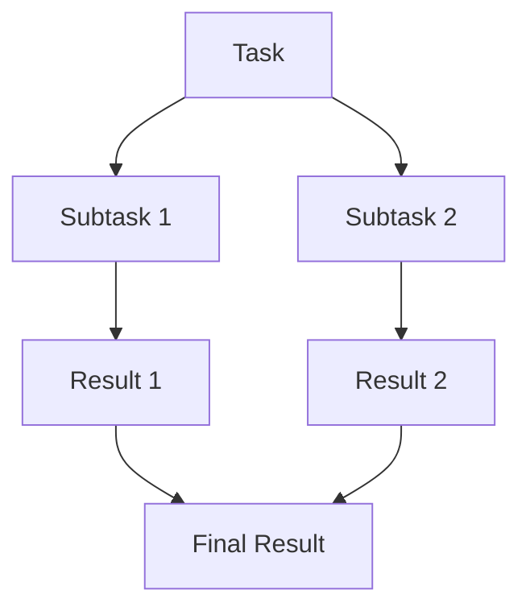
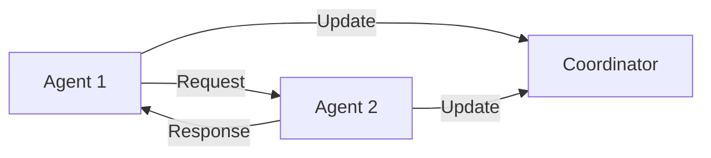

# Data Definitions

## Overview
This document defines the core data structures, types, and relationships used throughout the Multi-Agent Climate Risk Analysis System. It serves as a reference for developers, data scientists, and system integrators.

## Core Data Types

### Weather Data
```python
class WeatherData:
    temperature: float  # Temperature in Celsius
    humidity: float    # Relative humidity percentage
    wind_speed: float  # Wind speed in km/h
    wind_direction: str  # Cardinal direction (N, NE, E, SE, S, SW, W, NW)
    precipitation: float  # Precipitation amount in mm
    timestamp: datetime  # Time of measurement
    location: Location  # Geographic location
```

### Risk Assessment
```python
class RiskAssessment:
    risk_level: RiskLevel  # Enum: LOW, MEDIUM, HIGH, EXTREME
    confidence: float  # Confidence score (0-1)
    factors: List[RiskFactor]  # Contributing factors
    recommendations: List[str]  # Risk mitigation recommendations
    timestamp: datetime  # Assessment time
    location: Location  # Geographic location
```

### Agent State
```python
class AgentState:
    agent_id: str  # Unique identifier
    status: AgentStatus  # Enum: IDLE, BUSY, ERROR
    current_task: Optional[Task]  # Current task if any
    capabilities: List[Capability]  # Agent capabilities
    performance_metrics: Dict[str, float]  # Performance statistics
```

## Enums

### RiskLevel
```python
class RiskLevel(Enum):
    LOW = 1
    MEDIUM = 2
    HIGH = 3
    EXTREME = 4
```

### AgentStatus
```python
class AgentStatus(Enum):
    IDLE = "idle"
    BUSY = "busy"
    ERROR = "error"
    RECOVERING = "recovering"
```

### Capability
```python
class Capability(Enum):
    WEATHER_ANALYSIS = "weather_analysis"
    RISK_ASSESSMENT = "risk_assessment"
    DATA_PROCESSING = "data_processing"
    DECISION_MAKING = "decision_making"
```

## Data Relationships

### Task Dependencies


### Agent Communication


## Data Flow

### Weather Data Processing
1. Raw weather data collection
2. Data validation and cleaning
3. Feature extraction
4. Risk assessment
5. Result storage

### Risk Assessment Flow
1. Data aggregation
2. Risk factor analysis
3. Confidence calculation
4. Recommendation generation
5. Result distribution

## Data Storage

### Database Schema
```sql
-- Weather Data Table
CREATE TABLE weather_data (
    id SERIAL PRIMARY KEY,
    temperature FLOAT,
    humidity FLOAT,
    wind_speed FLOAT,
    wind_direction VARCHAR(2),
    precipitation FLOAT,
    timestamp TIMESTAMP,
    location_id INTEGER REFERENCES locations(id)
);

-- Risk Assessments Table
CREATE TABLE risk_assessments (
    id SERIAL PRIMARY KEY,
    risk_level INTEGER,
    confidence FLOAT,
    timestamp TIMESTAMP,
    location_id INTEGER REFERENCES locations(id)
);

-- Agent States Table
CREATE TABLE agent_states (
    id SERIAL PRIMARY KEY,
    agent_id VARCHAR(50),
    status VARCHAR(20),
    current_task_id INTEGER REFERENCES tasks(id),
    last_updated TIMESTAMP
);
```

## Data Validation Rules

### Weather Data
- Temperature: -50°C to 50°C
- Humidity: 0% to 100%
- Wind Speed: 0 to 300 km/h
- Wind Direction: Valid cardinal direction
- Precipitation: 0 to 1000 mm

### Risk Assessment
- Risk Level: Valid enum value
- Confidence: 0 to 1
- Timestamp: Valid datetime
- Location: Valid location ID

### Agent State
- Agent ID: Unique identifier
- Status: Valid enum value
- Current Task: Valid task ID or null
- Last Updated: Valid datetime

## Data Transformation

### Weather Data to Risk Assessment
```python
def transform_weather_to_risk(weather_data: WeatherData) -> RiskAssessment:
    """
    Transform weather data into risk assessment.
    
    Args:
        weather_data: Raw weather data
        
    Returns:
        RiskAssessment object
    """
    # Implementation details
    pass
```

### Risk Assessment to Recommendations
```python
def generate_recommendations(risk_assessment: RiskAssessment) -> List[str]:
    """
    Generate recommendations based on risk assessment.
    
    Args:
        risk_assessment: Risk assessment data
        
    Returns:
        List of recommendation strings
    """
    # Implementation details
    pass
```

## Data Security

### Access Control
- Role-based access control (RBAC)
- Data encryption at rest
- Secure data transmission
- Audit logging

### Data Privacy
- PII data handling
- Data retention policies
- Data anonymization
- Compliance requirements

## Data Quality

### Validation Rules
- Data type checking
- Range validation
- Format validation
- Relationship validation

### Quality Metrics
- Completeness
- Accuracy
- Timeliness
- Consistency

## Data Integration

### External Systems
- Weather API integration
- GIS system integration
- Emergency response systems
- Public alert systems

### Internal Systems
- Agent communication
- State management
- Task coordination
- Result aggregation

## Data Maintenance

### Backup Strategy
- Regular backups
- Point-in-time recovery
- Data archiving
- Disaster recovery

### Cleanup Procedures
- Data retention policies
- Archive management
- Temporary data cleanup
- Log rotation

## Data Monitoring

### Performance Metrics
- Response time
- Throughput
- Error rates
- Resource usage

### Health Checks
- Data integrity
- System availability
- Service status
- Resource utilization

## Data Documentation

### Schema Documentation
- Table definitions
- Field descriptions
- Relationship diagrams
- Index information

### API Documentation
- Endpoint descriptions
- Request/response formats
- Authentication requirements
- Rate limiting

## Data Migration

### Version Control
- Schema versioning
- Data migration scripts
- Rollback procedures
- Version compatibility

### Upgrade Procedures
- Data transformation
- Validation checks
- Performance testing
- User notification

## Data Recovery

### Error Handling
- Error detection
- Recovery procedures
- Data consistency
- System stability

### Disaster Recovery
- Backup restoration
- System recovery
- Data validation
- Service restoration

## Data Analytics

### Metrics Collection
- Performance metrics
- Usage statistics
- Error rates
- Resource utilization

### Analysis Functions
Functions for analyzing climate risks and data.

### Data Functions
Functions for data retrieval and processing.

### Development Functions
Functions for development and testing.

### Monitoring Functions
Functions for monitoring system performance and health.

## Data Governance

### Policies
- Data access
- Data usage
- Data retention
- Data security

### Compliance
- Regulatory requirements
- Industry standards
- Internal policies
- Audit requirements

## Data Lifecycle

### Creation
- Data collection
- Validation
- Storage
- Indexing

### Usage
- Access
- Processing
- Analysis
- Reporting

### Archival
- Retention
- Storage
- Access
- Deletion

## Data Standards

### Naming Conventions
- Table names
- Field names
- Index names
- Constraint names

### Coding Standards
- Data types
- Format rules
- Validation rules
- Error handling

## Data Tools

### Development Functions
Functions for development and testing.

### Monitoring Functions
Functions for monitoring system performance and health.

## Data Training

### Documentation
- User guides
- API documentation
- Best practices
- Examples

### Support
- Troubleshooting
- FAQ
- Contact information
- Escalation procedures 

## Historical Data Fetching

### Flooding Data
```python
def _get_historical_flood_data(self, lat: float, lon: float) -> List[Dict]:
    """Fetch historical flood data for a location using google_search.
    
    Args:
        lat (float): Latitude of the location
        lon (float): Longitude of the location
        
    Returns:
        List[Dict]: Historical flood events
    """
    query = f"historical flood events {lat} {lon} past 5 years"
    search_results = google_search(query)  # Placeholder for actual search logic
    return search_results  # Placeholder for actual parsing logic
```

### Extreme Heat Data
```python
def _get_historical_heat_data(self, lat: float, lon: float) -> List[Dict]:
    """Fetch historical heat data for a location using google_search.
    
    Args:
        lat (float): Latitude of the location
        lon (float): Longitude of the location
        
    Returns:
        List[Dict]: Historical extreme heat events
    """
    query = f"historical extreme heat events {lat} {lon} past 5 years"
    search_results = google_search(query)  # Placeholder for actual search logic
    return search_results  # Placeholder for actual parsing logic
```

### Data Flow
1. User requests a risk assessment for a specific location.
2. `ClimateRiskAnalyzer` fetches real-time weather data and historical data using `google_search`.
3. Historical data is used to determine if there have been multiple extreme events in the past five years.
4. If multiple events are detected, a `SUPER_EXTREME` risk level is reported with urgent recommendations. 